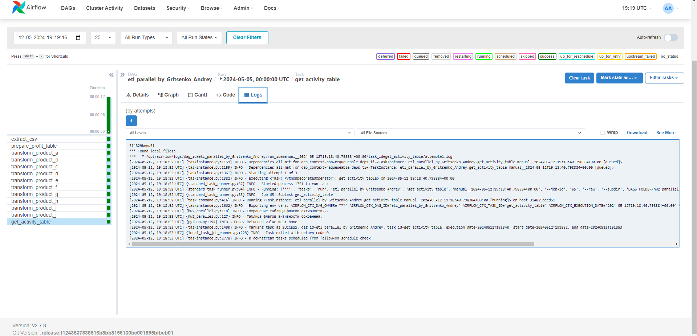

# 1/1   Инжиниринг данных. Итоговый проект (PJ)

## Запуск

Из папки с проектом задания (classes\main\data_engineering\hws\hw2 относительно корня репозитория):
```
docker-compose up
```
и дождаться пока airflow поднимется. 

Файл для обработки ```profit_table.csv``` добавлять в ```data``` в данном проекте -- настроен docker volume для чтения оттуда. Туда-же записывается результат.

p.s. т.к. ```profit_table.csv``` требует lfs его не стал добавлять в коммит.

## Скрины результатов

#### Основное задание


#### Дополнительное


